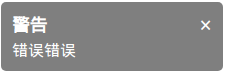
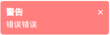

# js-alert


### 效果展示
          
           

### alert 使用
```javascript
tip.alert(message, title, type, time);
/*
*   type共四种: 'normal', 'warn', 'error', 'success', 不选择或不在这四种范围之内，默认为 'normal'
*   time 不选择默认为 2000
* */
```

### 修改默认样式
```javascript
//使用前修改
win.tip.style = {
        /* background color */
        bgc: {
            normal: 'rgba(0, 0, 0, .5)',
            error: 'rgba(255, 30, 30, .5)',
            warn: 'rgba(255, 255, 0, .5)',
            success: 'rgba(173, 255, 47, .5)'
        },
        /* font color */
        fc: {
            normal: '#FFF',
            error: '#FFF',
            warn: '#FFF',
            success: '#FFF',
            close: '#FFF'
        },
        body: {
            padding: '10px',
            top: '10px',
            right: '20px',
            bottom: '',
            left: '',
        }
    };
```